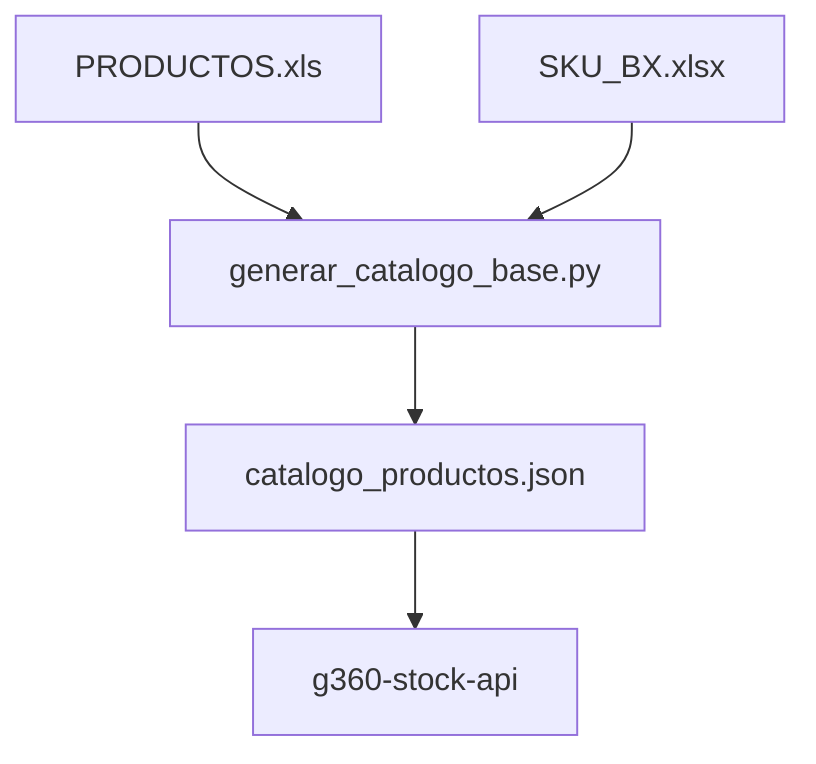

# G360 Master Data

> Sistema centralizado de datos maestros para proyectos G360.
> Genera JSON de catálogo completo desde ERP + SKU_BX.

[]()
[]()
[]()



---

## Estructura

```
g360-master-data/
├── data/
│   ├── PRODUCTOS.xls           ← Fuente principal (mensual/bimestral)
│   │   Columnas: CODIGO, NOMBRE, COD_EAN, COD_EAN_14, CAN_KG_UM,
│   │              LINEA, GRUPO, TIPO, FAMILIA, FLG_INACTIVO,
│   │              FLG_DESCONTINUADO, PRECIO
│   └── SKU_BX.xlsx             ← Guía primaria: qué se vende (manual, agregar cuando ingresa nuevo stock)
│       Columnas: ORDEN, SKU, UN_BX, ESTADO_LINEA
│
├── output/
│   ├── catalogo_productos.json ← Catálogo generado (2,488 SKUs: 2411 vigentes + 77 descontinuados en BX)
│   └── un_bx_master.csv        ← Lista simplificada SKU,un_bx (para importación manual)
│
├── scripts/
│   ├── generar_catalogo_base.py ← Genera catálogo desde ERP + SKU_BX (principal, v3)
│   ├── ver_estado.py            ← Muestra estado del catálogo generado
│   └── tests/                   ← Tests unitarios (pytest)
│
├── actualizar_catalogo.bat     ← Workflow interactivo + modo automático (--auto)
└── README.md
```

---

## Flujo de datos

```
1. Descargar PRODUCTOS.xls desde appweb.cipsa.com.pe (mensual/bimestral)
2. Actualizar SKU_BX.xlsx con nuevos SKUs (manual, cuando ingresa stock nuevo)
3. Ejecutar: actualizar_catalogo.bat → Opción 1 (o `actualizar_catalogo.bat --auto` para generar + subir sin preguntar)
4. Verificar output/catalogo_productos.json (opción 2 del bat)
5. Subir al API: Opción s en el bat (requiere `API_KEY` definida), o manualmente:
   curl -X POST "https://g360-stock-api.onrender.com/api/v1/catalog/upload" \
        -H "X-API-Key: %API_KEY%" \
        -F "archivo=@output/catalogo_productos.json"
```

> El `copy` a `..\g360-stock-api\data\catalog_cache.json` solo actualiza el entorno
> local de desarrollo. Producción (Render) **solo** se actualiza vía `POST /api/v1/catalog/upload`
> o vía auto-carga desde GitHub (`catalogo_raw_url`, TTL 6h).
> Definir la clave en la misma terminal antes de ejecutar:
> `set API_KEY=tu_clave` (cmd) o `$env:API_KEY="tu_clave"` (PowerShell).

---

## Filtros aplicados

SKU_BX es la guía primaria de lo que se vende: un descontinuado se incluye
solo si está curado en SKU_BX (llegó stock que se puede vender) y se marca
con `descontinuado: true`. Para vender un descontinuado, agrégalo a SKU_BX
y aparece marcado en el próximo catálogo.

| Filtro | Resultado |
|--------|-----------|
| Inactivos (FLG_INACTIVO) | Excluidos (siempre) |
| Descontinuados fuera de BX | Excluidos |
| Descontinuados en BX | **Incluidos con `descontinuado: true`** (77) |
| Sin precio (≤0) | Excluidos (siempre) |
| Líneas de proceso | Excluidas (siempre) |
| SKUs duplicados en ERP | Solo el primero |
| SKUs en BX sin ERP | Advertencia y se omiten (ej. `04058`) |
| **Productos finales** | **2,488 SKUs** |

---

## Datos generados

| Campo | Fuente | Notas |
|-------|--------|-------|
| sku, nombre | PRODUCTOS.xls | |
| ean13 | PRODUCTOS.xls | ~58% tiene valor |
| ean14 | PRODUCTOS.xls | ~34% tiene valor |
| peso_kg | PRODUCTOS.xls | ~96% tiene valor |
| linea, grupo, tipo, familia | PRODUCTOS.xls | |
| linea_codigo | Mapa estático derivado del reporte de stock | Código corto 2 chars (ej. `PELOTAS`→`01`, `ARCHIVO`→`78`, `MASCOTAS`→`MA`); vacío si la línea no está en el mapa (`VARIOS`) |
| categoria | Derivada de linea | VINIBALL, VINIFAN, REPRESENTADAS |
| un_bx | SKU_BX.xlsx | 41% tiene valor definido |
| orden | SKU_BX.xlsx (col A) | Índice maestro — orden ascendente |
| estado_linea | SKU_BX.xlsx (col D) | NACIONAL, IMPORTADO, NUEVO, TRADICIONAL |
| precio | PRODUCTOS.xls | |
| descontinuado | PRODUCTOS.xls (FLG_DESCONTINUADO) + SKU_BX | `true` si está descontinuado y curado en BX; el API lo propaga como badge |
| nombre_corto | Generado con regex | Elimina prefijos, marcas |
| keywords | Generado automáticamente | Palabras clave del nombre + categoria |

---

## Scripts

### `generar_catalogo_base.py`

Genera el catálogo completo desde las dos fuentes.

```bash
# Uso básico
python scripts/generar_catalogo_base.py

# Con argumentos
python scripts/generar_catalogo_base.py -i data/PRODUCTOS.xls -u data/SKU_BX.xlsx -o output/catalogo_productos.json

# Solo validación (no genera output)
python scripts/generar_catalogo_base.py --validate-only
```

### `actualizar_catalogo.bat`

Workflow interactivo + modo automático:

```
1) Generar catalogo base (PRODUCTOS.xls + SKU_BX)
2) Ver estado del catalogo
0) Salir
```

```bat
:: Interactivo (menu)
actualizar_catalogo.bat

:: Automatico: genera + sube al API sin preguntar (requiere API_KEY)
actualizar_catalogo.bat --auto

:: Automatico local: genera + copia local, sin subir
actualizar_catalogo.bat --auto-local

:: Subir JSON existente sin regenerar (requiere API_KEY)
actualizar_catalogo.bat --upload
```

El upload reintenta 3 veces (cold start de Render free-tier) y requiere
`X-API-Key` (variable `API_KEY` en la terminal). En modo interactivo, si
falta la clave el BAT la pide por pantalla; los valores degenerados
(<4 caracteres) se rechazan al instante sin consumir reintentos.

Para persistirla (una sola vez, `cmd` — ojo: `setx` va SIN `=`):
```bat
set API_KEY=tu_clave
setx API_KEY tu_clave
```

---

## Output JSON

```json
{
  "metadata": {
    "version": "3.0.0",
    "generated_at": "2026-08-09T03:20:11.919920",
    "source_erp": "PRODUCTOS.xls",
    "source_un_bx": "SKU_BX.xlsx",
    "total_productos": 2393,
    "estadisticas": {
      "sin_ean13": 1398,
      "con_ean14": 813,
      "sin_unbx": 1378,
      "con_unbx": 1015,
      "por_categoria": {
        "REPRESENTADAS": 1187,
        "VINIFAN": 767,
        "VINIBALL": 439
      },
      "por_linea": {
        "PELOTAS": 423,
        "ARCHIVO": 308,
        "REPRESENTADAS": 773,
        ...
      },
      "por_estado_linea": {
        "NACIONAL": 137,
        "IMPORTADO": 265,
        "NUEVO": 454,
        "TRADICIONAL": 172
      }
    }
  },
  "productos": [
    {
      "sku": "011019",
      "nombre": "N SEMIDEPORTIVA FUTBOL CRACKCITO BLANCO C/ROJO",
      "nombre_corto": "Semideportiva Futbol Crackcito Blanco C/Rojo",
      "ean13": "7754807110198",
      "ean14": "",
      "categoria": "VINIBALL",
      "linea": "PELOTAS",
      "grupo": "NACIONAL",
      "tipo": "SEMI-DEPORTIVA",
      "familia": "FUTBOL",
      "un_bx": 60,
      "orden": 2,
      "estado_linea": "NACIONAL",
      "peso_kg": 0.20,
      "precio": 9.16,
      "keywords": ["BLANCO", "C/ROJO", "CRACKCITO", "FUTBOL", "PELOTAS", "SEMIDEPORTIVA", "VINIBALL"]
    }
  ]
}
```

---

## Integración con API

El endpoint `/api/v1/catalog/upload` recibe el JSON y lo cachea en memoria (TTL 6h).
Las operaciones de catálogo requieren el header administrativo `X-API-Key`.
Los items de stock siempre se sirven enriquecidos y requieren la clave de lectura
`X-API-Key` configurada para el cliente.

```bash
# Verificar estado del catálogo cargado
curl -H "X-API-Key: $S1_API_KEY" \
     "https://g360-stock-api.onrender.com/api/v1/catalog/health"

# Subir catálogo
curl -X POST "https://g360-stock-api.onrender.com/api/v1/catalog/upload" \
     -H "X-API-Key: $S1_API_KEY" \
     -F "archivo=@output/catalogo_productos.json"
```

---

## Dependency

```
python>=3.11
openpyxl>=3.1.0
xlrd>=2.0.0
```

---

## Familia G360

- **[g360-cli](https://github.com/carloscus/g360-cli)**: Bootstrap de proyectos
- **[g360-stock-api](../g360-stock-api/)**: API de stock con cache y enrich
- **[g360-stock-reporter-lit](../g360-stock-reporter-lit/)**: Frontend PWA

---
**Marca**: G360 · **Autor**: Carlos Cusi
