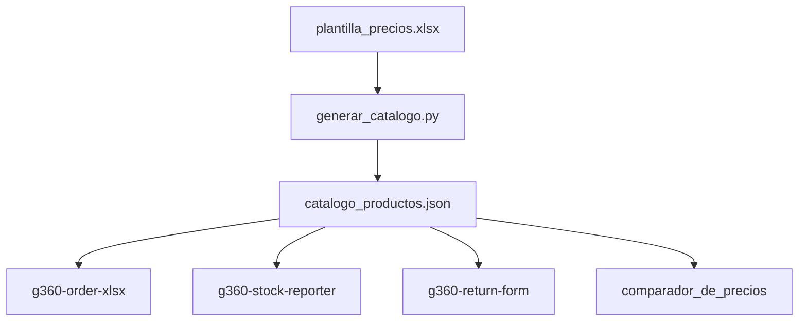

# G360 Master Data

> Sistema centralizado de datos maestros para proyectos G360. Genera JSONs de catalogo consolidado que alimentan multiples herramientas del ecosistema.

[](https://github.com/carloscus/g360-master-data)
[](https://python.org)
[](https://opensource.org/licenses/MIT)



---

## Tabla de Contenidos

- [Descripcion](#descripcion)
- [Caracteristicas](#caracteristicas)
- [Tecnologias](#tecnologias)
- [Instalacion](#instalacion)
- [Uso](#uso)
- [Estructura del Excel](#estructura-del-excel)
- [JSON Generado](#json-generado)
- [Scripts](#scripts)
- [Tests](#tests)
- [Automatizacion](#automatizacion)
- [Contribucion](#contribucion)
- [Licencia](#licencia)
- [Familia G360](#familia-g360)

---

## Descripcion

Sistema centralizado que genera JSONs de catalogo consolidado desde una plantilla Excel. Estos JSONs alimentan multiples herramientas del ecosistema G360: pedidos, reportes de stock, devoluciones y cotizaciones.

**Tipo**: Script / Data Pipeline
**Lenguaje**: Python
**Entrada**: Excel (plantilla_precios.xlsx)
**Salida**: JSON (catalogo_productos.json)

---

## Caracteristicas

- **Consolidacion**: Merge de productos, descuentos y precios fijos en un solo JSON
- **Validaciones**: Campos obligatorios (SKU, nombre, categoria, linea), SKUs duplicados ignorados
- **Descuentos dinamicos**: N columnas de descuentos consecutivos
- **Precio final**: Calculo automatico (descuentos o precio fijo)
- **nombre_corto**: Generado automaticamente con regex
- **keywords**: Generado automaticamente para busquedas
- **Automatizacion**: `actualizar_catalogo.bat` genera y copia a proyectos G360

---

## Tecnologias

| Capa | Tecnologia |
|---|---|
| Lenguaje | Python 3.11+ |
| Excel | openpyxl |
| Runtime | uv (gestor de paquetes) |
| Tests | pytest |

---

## Instalacion

```bash
git clone https://github.com/carloscus/g360-master-data.git
cd g360-master-data
uv venv
uv pip install openpyxl
```

---

## Uso

### Generar catalogo

```bash
.venv\Scripts\python scripts/generar_catalogo.py -i data/plantilla_precios.xlsx -o output/catalogo_productos.json
```

### Copiar a proyectos

```bash
# Order XLSX
cp output/catalogo_productos.json ../g360-order-xlsx/public/

# Stock Reporter
cp output/catalogo_productos.json ../g360-stock-reporter/public/

# Devoluciones
cp output/catalogo_productos.json ../g360-return-form/public/
```

### Automatizado

```bash
./actualizar_catalogo.bat    # Genera + copia automaticamente
```

---

## Estructura del Excel

La plantilla `plantilla_precios.xlsx` contiene 4 hojas:

### Hoja 1: PRODUCTOS (principal)

| Columna | Descripcion | Obligatorio |
|---------|-------------|-------------|
| `orden` | Indice para interface | Si |
| `sku` | Identificador unico | Si |
| `nombre` | Descripcion completa | Si |
| `ean13` | Codigo de barras | No |
| `categoria` | VINIBALL/VINIFAN/REPRESENTADAS | Si |
| `subcategoria` | Subclasificacion | No |
| `linea` | PELOTAS, FORROS, ARCHIVO, etc. | Si |
| `grupo` | IMPORTADA VINIBALL, ROCHELLE, etc. | No |
| `tipo` | PU, CUERO TERMOSELLADA, etc. | No |
| `familia` | FUTBOL, VOLEY, BASQUET, etc. | No |
| `unidad_medida` | UND | No |
| `peso_kg` | Peso en kg | No |
| `un_bx` | Unidades por caja | No |
| `precio_lista` | Precio de lista | No |
| `moneda` | PEN | No |
| `imagen_url` | URL de imagen | No |

### Hoja 2: DESCUENTOS

| Columna | Descripcion |
|---------|-------------|
| `sku` | Codigo de producto |
| `desc1` - `desc4` | Descuentos (decimal, ej: 0.13 = 13%) |

### Hoja 3: PRECIOS_FIJOS

| Columna | Descripcion |
|---------|-------------|
| `sku` | Codigo de producto |
| `precio_fijo` | Precio de remate/liquidacion |

### Hoja 4: SKU_CLIENTES (opcional)

| Columna | Descripcion |
|---------|-------------|
| `sku` | Codigo interno |
| `sku_cliente` | Codigo del cliente |

---

## JSON Generado

```json
{
  "metadata": {
    "version": "2.0.0",
    "total_productos": 1088,
    "estadisticas": {
      "sin_ean13": 148,
      "con_descuento": 339,
      "con_precio_fijo": 129
    }
  },
  "productos": [
    {
      "sku": "016763",
      "nombre": "FUTBOL PU FUTURE #5",
      "nombre_corto": "Futbol Future #5",
      "categoria": "VINIBALL",
      "linea": "PELOTAS",
      "un_bx": 18,
      "precio_lista": 70.0,
      "descuentos": [0, 0, 0, 0],
      "precio_final": 70.0,
      "es_remate": false
    }
  ]
}
```

---

## Scripts

### `generar_catalogo.py`

Genera el catalogo consolidado desde el Excel.

**Funcionalidades:**
- Lee hoja PRODUCTOS (datos base)
- Lee hoja DESCUENTOS (descuentos por SKU)
- Lee hoja PRECIOS_FIJOS (remates/liquidaciones)
- Genera `nombre_corto` con regex
- Genera `keywords` automaticamente
- Calcula `precio_final` (descuentos o precio fijo)
- Valida campos obligatorios
- Ignora SKUs duplicados

### `leer_plantilla_precios.py`

Lee precios con mapeo de codigos de cliente.

```bash
.venv\Scripts\python scripts/leer_plantilla_precios.py -i data/plantilla_precios.xlsx -o output/precios_productos.json
```

---

## Tests

```bash
.venv\Scripts\python -m pytest scripts/tests/ -v
```

**Funciones testeadas:**
- `generar_nombre_corto()` - Validacion de regex y reglas
- `validar_ean13()` - Validacion de codigos de barras
- Calculo de descuentos consecutivos
- Validaciones de campos obligatorios

---

## Automatizacion

### `actualizar_catalogo.bat`

Script batch que automatiza la actualizacion del catalogo.

**Funcionalidades:**
- Verifica entorno virtual
- Genera catalogo consolidado
- Copia automaticamente a proyectos G360
- Muestra resumen de operacion

**Proyectos actualizados automaticamente:**
- g360-order-xlsx
- g360-stock-reporter
- g360-return-form
- comparador_de_precios

---

## Contribucion

1. Fork el repositorio
2. Crea una rama (`git checkout -b feature/nueva-funcion`)
3. Commit cambios (`git commit -m 'Agregar funcion'`)
4. Push a la rama (`git push origin feature/nueva-funcion`)
5. Abre un Pull Request

---

## Licencia

MIT License - ver [LICENSE](LICENSE) para mas detalles.

---

## Familia G360

Este proyecto forma parte de la familia de microherramientas **G360** para apoyo CRM y gestion de datos en escritorio, enfocadas en areas como ventas, finanzas y logistica.

### Herramientas Relacionadas

- **[g360-cli](https://github.com/carloscus/g360-cli)**: Bootstrap de proyectos G360
- **[g360-signature](https://github.com/carloscus/g360-signature)**: Web component de branding
- **[g360-order-xlsx](https://github.com/carloscus/g360-order-xlsx)**: Procesador de cotizaciones Excel
- **[g360-signature-creator](https://github.com/carloscus/g360-signature-creator)**: Generador de firmas corporativas

---

**Marca**: G360
**Isotipo**: 3 puntos verticales paralelos (gris-verde-gris) + chevron `>`
**Autor**: Carlos Cusi
**Desarrollo**: Con asistencia de herramientas de codigo IA (Vibe Code)
**Powered by**: [g360-signature](https://github.com/carloscus/g360-signature)
